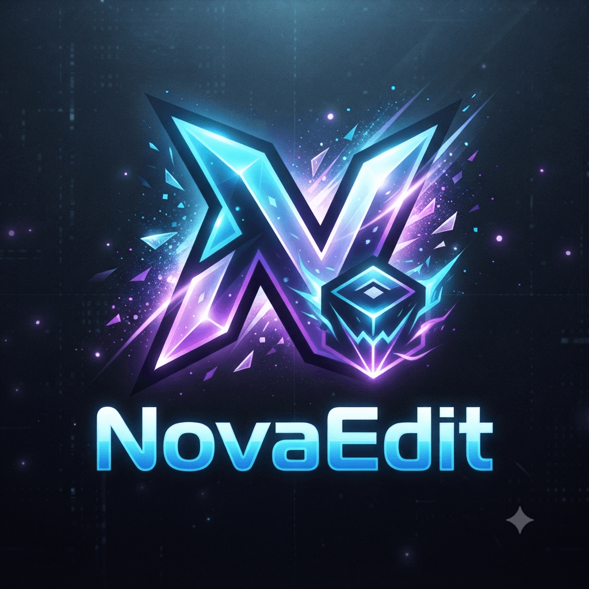

#  NovaEdit

> [!NOTE]
> **NovaEdit is a private Geometry Dash editor enhancement mod developed by Homeless Team.**
>
> NovaEdit is based on **BetterEdit by HJfod** and aims to maintain compatibility with future Geometry Dash updates while improving the editor experience with new tools and features.
>
> NovaEdit is **not an official continuation of BetterEdit**.

  

 

A mod that makes the <a href="https://store.steampowered.com/app/322170/Geometry_Dash/">Geometry Dash</a> editor easier, faster, and more powerful.

## :rocket: Installation

NovaEdit is currently a private project and is not publicly available.

Installation builds are only provided to members of the Homeless Team.

## :sparkles: Features

NovaEdit improves the Geometry Dash editor workflow with additional tools and quality-of-life improvements.

Features may include:

- Improved level creation workflow
- Additional editor utilities
- Better editing experience
- Compatibility updates for future Geometry Dash versions
- Custom tools developed by Homeless Team

## :wrench: Development

NovaEdit is developed using:

- C++
- Geode SDK
- Geometry Dash modding APIs

The project focuses on maintaining a clean and extendable editor enhancement system.

## :beetle: Bug Reports & Suggestions

NovaEdit is currently a private project.

Homeless Team members can report bugs and suggest features through internal team channels.

## :speech_balloon: Credits

NovaEdit is based on **BetterEdit by HJfod**.

Original projects:

- BetterEdit — HJfod
- Geode — Geode Team

Special thanks to HJfod for creating BetterEdit and contributing greatly to the Geometry Dash modding community.

## :page_facing_up: Licensing

NovaEdit contains modified code from BetterEdit.

### Original BetterEdit Code

- License: GNU Lesser General Public License v3.0 (LGPLv3)
- Author: HJfod

All original license notices and credits are preserved.

### Homeless Team Code

Additional code, features, and modifications created by Homeless Team are licensed under the **Homeless Team EULA**.

Both licenses apply to their respective parts of the project.

## :warning: Disclaimer

NovaEdit is a private fork created for development and maintenance purposes.

It is not affiliated with or endorsed by HJfod.

BetterEdit remains the original work and legacy of HJfod.

Thank you to everyone who contributed to the Geometry Dash modding community.

## ❤️ Support HJfod

Nova Edit is a fork of Better Edit by HJfod.

- GitHub Sponsors: [HJfod](https://github.com/sponsors/HJfod)
- Ko-fi: [hjfod](https://ko-fi.com/hjfod)
- PayPal: [hjfod](https://paypal.me/hjfod)
